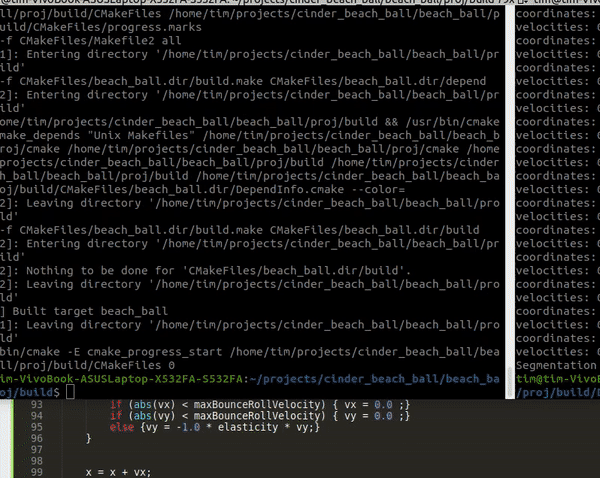

# cinder_beach_ball
Bouncing beach ball setup in C++ using Cinder framework

This is a small Cinder project I did for a job interview

As it is built on a linux environment some tweaking might be necessary

## Demo:
  

## Requirements:
  Install Cinder

## How to build:
  Modify proj/cmake/CMakeLists.txt line 6 to use the path for Cinder
    cd proj
    mkdir build
    cd build
    cmake ../cmake
    make -j 8

## How to try:
  cd Debug/beach_ball
    ./beach_ball
